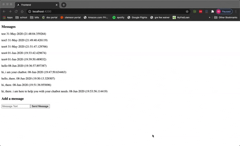

This project is a quick example to show case a quick angular frontend, flask api, and postgres db. 
This project takes in a message and then sends it to slack. Previous messages that were sent are listed as well.

   

- To run this project, install npm, and python3. 
- To install python packages, run `pip3 install -r requirments.txt`. 
- To install angular packages, run `npm install` in the frontend. 
- Change to frontend directory, run `ng serve`.
- To get the database to run, run `docker-compose up -d`.
- To run the api, run `python3 app.py` in the root of the project.
